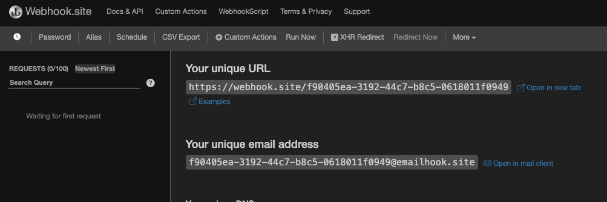
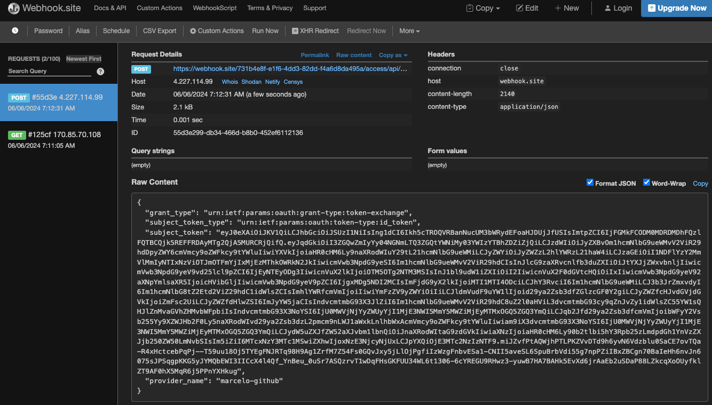
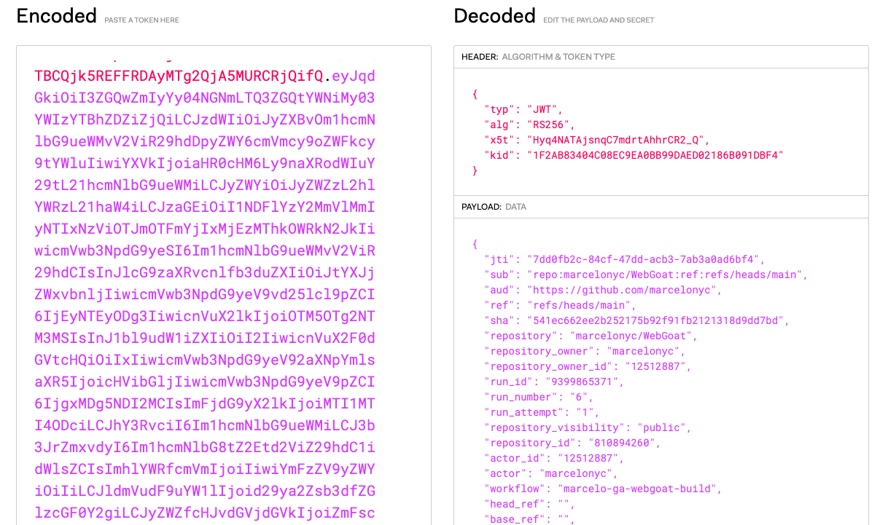
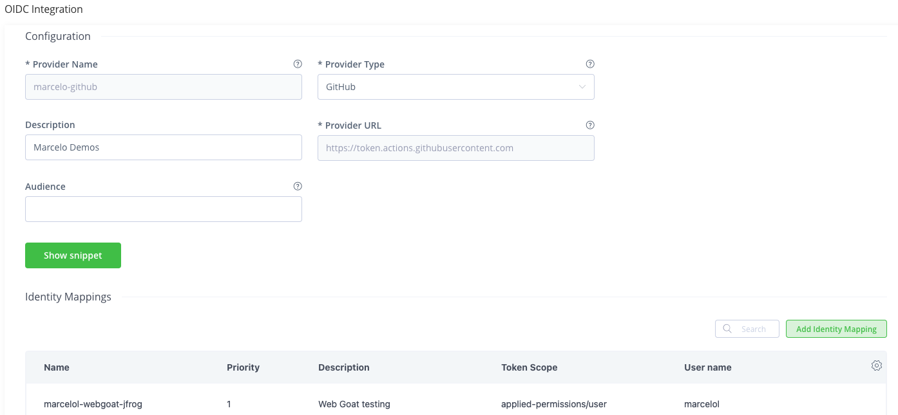
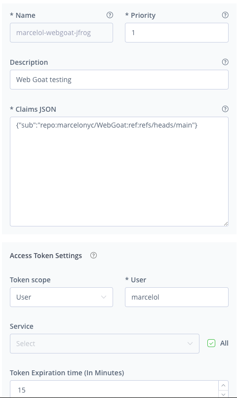

# Get started with GA integration with JFrog

This project has several workflows, each progresing on integration steps between GitHub Actions and JFrog. Follow each build by number to understand the integration points. 

Each build is configure to be executed manually.

You can read detailed documentation about how OIDC works, but the most important thing to understand is that GirHub and JFrog exchange tokens to validate each other's trust. The token sent to JFrog is decoded and parsed to match a key/value to the Claims JSON. This match is what will confirm the identity mapping to a JFrog identity.

## Pre-reqs and Set up

- Fork this project in GitHub
- Setup OIDC integration in JFrog
    - NOTE: **at this point, do not set identity mapping**
    - Provider Name: remember this, you will need it.
    - Provider Type: GitHub
    - Leave the rest blank
- Set these environment variables for GitHub Actions in your forked repo (GH Repo - > Settings->Secrets and variables->Variables)
    - JF_URL:  JFrog Domain on (Eg. soleng.jfrog.io)
    - JF_PROJECT: Your project name
    - OIDC_PROVIDER_NAME: Provider name from above step 
    - UNIQUE_ID: To make it yours, a STRING to use to identify your repos/project/build name in JFrog. I am setting this just to make this project more re usable. 
        -   For example, the python repo name will be ga-jfrog-pip-remote-<UNIQUE_ID>
- Create these locations in artifactory
    - ga-jfrog-pip-remote-<UNIQUE_ID>  Python remote repo
    - A project (whatever you call it in the JF_PROJECT variable)
        - Add Python repo to project (Enable Xray Indexing)
    - (Optional: Xray) Add the build to index resources By Pattern
        - Go to Administration->Xray Setting->Index Resources->Builds->Manage Builds
        - Select By Pattern
        - Build Name Include Pattern: ga-jfrog-build-<UNIQUE_ID>

## 1.ga-jfrog-primer-oidc.yaml
In this action we will explore the token we receive from GitHub. I am taking you through this because you will need to understand the payload to construct a claim for the identity mapping. The only purpose of this action is to intercept the token and review it. 

NOTE: The action is expected to fail. Wwe are only looking to get the Token from GH.

1. Go to https://webhook.site 
2. Copy url (Eg. webhook.site/f90405ea-3192-44c7-b8c5-0618011f0949)

3. Change the GH repo variable JF_URL to the url you got (it should be domain/uuid)
4. Run the workflow ga-jfrog-primer
5. Watch the webhook.site activity.
    - You should see the payload with the token (subject_token).

6. Copy the content of subject_token
7. Go to https://jwt.io and paste the token into the Encoded text box.

Use the keys in your PAYLOAD DATA to setup Claims JSON in the identity mapping in JFRog. JFrog expects a key to match between GitHub and JFrog.

For example

`{"sub" : "repo:marcelonyc/WebGoat:ref:refs/heads/main"}`

## Setup identity mapping
Now we will **Add identity mapping** and re run the workflow. This time it should run succesfully.

Setup identity mapping under the OIDC integration you configured above.

- Click on Add Identity Mapping

We keep it simple for now
- Name: <Anything>
- Priority: 0
- Claims JSON: Take "sub" from the token
Eg. `{"sub" : "repo:marcelonyc/WebGoat:ref:refs/heads/main"}`
- Token Scope: User
- User Name: JFrog user to map to
- Service: Artifactory
- Token Expiration: Minutes, for as long as you action takes to run 

Run the workflow again. This time it should succeed.

## 1.ga-jfrog-primer-build.yaml
A more complete example showing links to artifacts in JFrog.
Before you run this workflow, change the GH repo variable JF_URL to the url of your JFrog instance.

